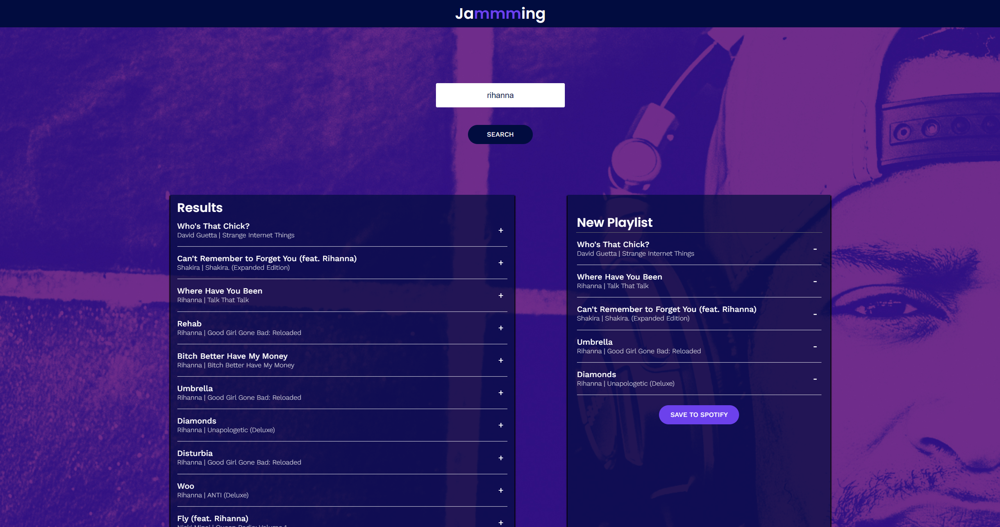

## React Project - Jammming

Jammming is a React app that makes creating custom spotify playlist easier. You can search song, album or artist on searchbar, add the songs from search result to playlist section by clicking + icon. Then you can rename the title of playlist section and add to your own spotify list by clicking save to spotify button.

[You Can See the Project Here](https://kubilayture-ravenous-app.netlify.app/)

## Features

- Spotify Login — the first time a user searches for a song, album, or artist, Spotify will ask them to log in or set up a new account.
- Search by Song, Album, or Artist — a user can type the name of a song, artist, or album into the search bar and click the SEARCH button.
- Populate Results List — Jammming displays the list of returned tracks from the user’s query.
- Add Song to a Custom Playlist — users can add a track to their playlist by selecting a + sign on the right side of the track’s display container.
- Remove Song from Custom Playlist — users can remove a track from their playlist by selecting a - sign on the right side of the track’s display container.
- Change Playlist Title — users can change the title of their custom playlist.
- Save Playlist to Account — users can save their custom playlist by clicking a button called SAVE TO SPOTIFY.

## List of some potential features will be added to Ravenous:

- Pressing enter triggers a search
- Include preview samples for each track
- Only display songs not currently present in the playlist in the search results
- Add a loading screen while playlist is saving
- Update the access token logic to expire at exactly the right time, instead of setting expiration from when the user initiates their next search
- After user redirect on login, restoring the search term from before the redirect
- Ensure playlist information doesn’t get cleared if a user has to refresh their access token
- Provide a way to fetch and see all your existing playlists

